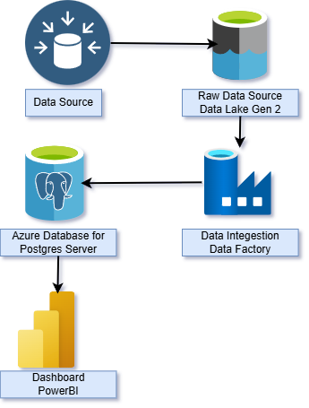

# 💼 Azure Financial Analytics Pipeline

This project builds an end-to-end **financial analytics pipeline on Microsoft Azure**, using Blob Storage for raw data, Azure Database for PostgreSQL for structured storage, and Power BI (Service) for interactive visualizations. The pipeline processes datasets related to company rankings by various financial metrics, providing insights into corporate performance at scale.

---

---

## 📦 Dataset Summary

This project analyzes financial metrics across global companies using the following CSV datasets:

| File Name                               | Description                            |
|----------------------------------------|----------------------------------------|
| `Companies_ranked_by_Dividend_Yield`   | Top companies sorted by dividend yield |
| `Companies_ranked_by_Earnings`         | Companies ranked by earnings           |
| `Companies_ranked_by_Market_Cap`       | Global rankings by market cap          |
| `Companies_ranked_by_P_E_ratio`        | Sorted by Price-to-Earnings ratio      |
| `Companies_ranked_by_Revenue`          | High-revenue companies worldwide       |

Uploaded and stored in **Azure Blob Storage** container `rawdata`.

---

## 🛠️ Technologies Used

- **Azure Blob Storage** – Store raw CSV files
- **Azure Database for PostgreSQL** – Structured data layer
- **Power BI (Service)** – Build reports online without Power BI Desktop
- **Azure Data Factory** – Optional for orchestrated ingestion
- **Azure Key Vault** – Store DB credentials securely (recommended)

---

## 🔧 Setup Instructions

### 1. Azure Setup
- Create a **Storage Account** and upload CSV files to `rawdata` container
- Create **Azure Database for PostgreSQL (Flexible Server)**
- Configure:
  - Public access
  - SSL enabled
  - Firewall rules to allow Power BI
- Create a table schema matching CSV files

### 2. Load Data into PostgreSQL
You can use:
- Azure Data Factory (Blob ➝ PostgreSQL copy activity)
- Python (`pandas.to_sql()` + `psycopg2`)

### 3. Connect Power BI Web to PostgreSQL
- Go to [Power BI](https://app.powerbi.com)
- Create a dataset using **PostgreSQL**
- Enter server, database, username/password
- Enable **SSL**
- Load the desired tables or views

---

## 📊 Sample Dashboard Ideas

- 💹 Company rankings by market cap
- 
- 🏦 P/E ratio vs earnings comparison
- 📈 Revenue vs dividend yield correlations
- 🧮 Sector-wide performance indicators

---

## 📎 Resources

- [Azure PostgreSQL Docs](https://learn.microsoft.com/en-us/azure/postgresql/)
- [Power BI PostgreSQL Setup](https://learn.microsoft.com/en-us/power-bi/connect-data/service-connect-to-postgresql)
- [Azure Storage Docs](https://learn.microsoft.com/en-us/azure/storage/)

---

## 👤 Author

**Parbat Rajpurohit**  
Azure Data Engineer | Cloud Analyst  
[GitHub Profile](https://github.com/parbatrajpurohit)

---

## 📜 License

This project is licensed under the **MIT License**.
